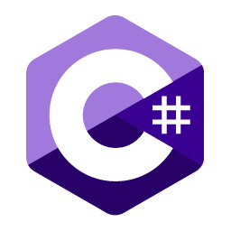

<h3>Olá, sou Gabriel Back! Deixa eu me apresentar!</h3>

Estudante de C#, atualmente trabalho como programador CAM , tenho 32 anos. Sou de Joinville SC, amante de desafios, programação, conectividade e portabilidade!

<h4>Me encontre também!</h4>

### Desenvolvendo meus conhecimentos em:
|||
 

